# 🏨 StayEase Hotel Booking System — Complete Feature Flow Document

> **Full-Stack Architecture Mapping: Angular 19 Frontend ↔ ASP.NET 8 Backend ↔ MySQL Database**
> Every feature is traced end-to-end: from the user clicking a button on screen, all the way down to the database table row being read or written.

---

## Table of Contents

1. [System Architecture Overview](#1-system-architecture-overview)
2. [Feature 1: User Registration](#2-feature-1-user-registration)
3. [Feature 2: User Login (JWT Authentication)](#3-feature-2-user-login-jwt-authentication)
4. [Feature 3: Auto-Login on Page Refresh (State Restoration)](#4-feature-3-auto-login-on-page-refresh)
5. [Feature 4: Logout](#5-feature-4-logout)
6. [Feature 5: View All Hotels (Landing Page)](#6-feature-5-view-all-hotels)
7. [Feature 6: Search & Filter Rooms (Dynamic Filtering)](#7-feature-6-search--filter-rooms)
8. [Feature 7: View Rooms by Hotel](#8-feature-7-view-rooms-by-hotel)
9. [Feature 8: Check Room Availability](#9-feature-8-check-room-availability)
10. [Feature 9: Create Booking (with Coupon Support)](#10-feature-9-create-booking)
11. [Feature 10: Booking Success & Email Confirmation](#11-feature-10-booking-success--email)
12. [Feature 11: View My Bookings (History)](#12-feature-11-view-my-bookings)
13. [Feature 12: Quick Rebook](#13-feature-12-quick-rebook)
14. [Feature 13: Admin — Add Hotel](#14-feature-13-admin--add-hotel)
15. [Feature 14: Admin — Add Room](#15-feature-14-admin--add-room)
16. [Feature 15: Admin — Create Coupon](#16-feature-15-admin--create-coupon)
17. [Feature 16: Admin — Toggle Coupon](#17-feature-16-admin--toggle-coupon)
18. [Feature 17: Validate Coupon](#18-feature-17-validate-coupon)
19. [Feature 18: Route Protection (Guards)](#19-feature-18-route-protection)
20. [Feature 19: JWT Token Injection (Interceptor)](#20-feature-19-jwt-token-injection)
21. [Feature 20: Global Exception Handling (Middleware)](#21-feature-20-global-exception-handling)
22. [Database Schema Reference](#22-database-schema-reference)

---

## 1. System Architecture Overview

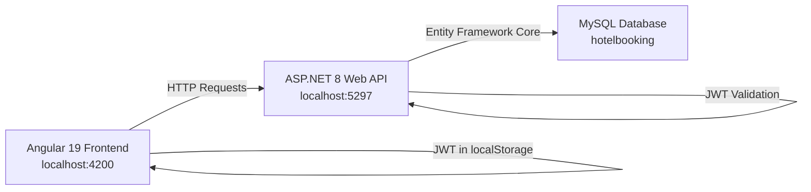

### Technology Stack

| Layer | Technology | Purpose |
|-------|-----------|---------|
| Frontend | Angular 19 + TypeScript | UI Components, Routing, Signals |
| HTTP Client | Angular HttpClient | API Communication |
| Auth State | Angular Signals (`signal()`, `computed()`) | Reactive Auth State |
| Interceptor | `HttpInterceptorFn` | Auto-attach JWT to requests |
| Guards | `CanActivateFn` | Route protection |
| Backend | ASP.NET 8 Web API | REST API Controllers |
| ORM | Entity Framework Core (MySQL) | Database access |
| Auth | JWT Bearer + BCrypt | Token-based authentication |
| Database | MySQL 8.0 | Persistent data storage |

### Request Lifecycle (Every API Call)

```
User Action → Angular Component → Angular Service → HttpClient.get/post()
    → AuthInterceptor (attaches JWT) → HTTP Request to ASP.NET
    → GlobalExceptionMiddleware → Controller → Service → EF Core → MySQL
    → Response ← Controller ← Service ← EF Core ← MySQL
    → Angular Service (Observable) → Component (updates UI)
```

---

## 2. Feature 1: User Registration

### Flow Diagram

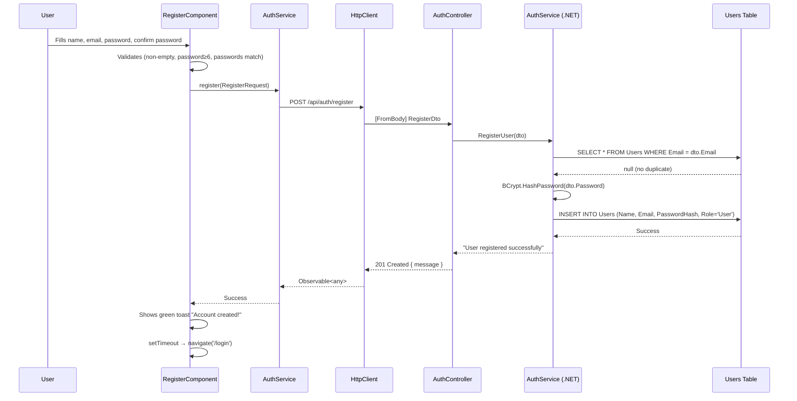

### Detailed Mapping

| Layer | File | Element | Details |
|-------|------|---------|---------|
| **Component** | `register.component.ts` | `RegisterComponent` | Standalone, uses `FormsModule` |
| **Template** | `register.component.html` | Form with `ngModel` | name, email, password, confirmPassword fields |
| **Frontend Model** | `user.model.ts` | `RegisterRequest` | `{ name: string, email: string, password: string }` |
| **Service** | `auth.service.ts` | `register()` | `POST` to `/api/auth/register` |
| **Interceptor** | — | Not used | Registration is public (no JWT needed) |
| **Controller** | `AuthController.cs` | `POST /api/auth/register` | `[HttpPost("register")]` — No `[Authorize]` |
| **Backend DTO** | `RegisterDto.cs` | `RegisterDto` | `{ Name, Email, Password }` |
| **Backend Service** | `AuthService.cs` | `RegisterUser()` | Checks duplicate email → BCrypt hash → INSERT |
| **Database Model** | `User.cs` | `User` | `UserId, Name, Email, PasswordHash, Role, CreatedAt` |
| **DB Table** | `Users` | INSERT | Role defaults to `"User"` |
| **Operation** | — | CREATE | New row in Users table |

### Step-by-Step Explanation

1. **User fills the form** — Name, Email, Password, Confirm Password fields bound via `[(ngModel)]`
2. **Frontend validation** — Component checks: all fields non-empty, password ≥ 6 chars, passwords match
3. **Service call** — `authService.register(registerData)` fires `POST` to `/api/auth/register`
4. **No interceptor** — Registration is a public endpoint; no JWT token is attached
5. **Controller receives** — `AuthController.RegisterUser()` receives `RegisterDto` from request body
6. **Backend checks duplicate** — Queries `Users` table for existing email
7. **Password hashing** — BCrypt hashes the plain password (never stored as plain text)
8. **Database INSERT** — New `User` row created with `Role = "User"` (default)
9. **Response** — Returns `201 Created` with `{ message: "User registered successfully" }`
10. **UI feedback** — Green toast appears, then auto-redirects to `/login` after 1.5 seconds

---

## 3. Feature 2: User Login (JWT Authentication)

### Flow Diagram

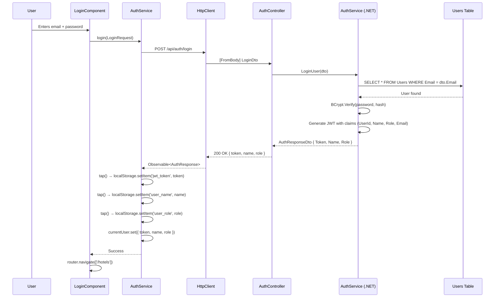

### Detailed Mapping

| Layer | File | Element | Details |
|-------|------|---------|---------|
| **Component** | `login.component.ts` | `LoginComponent` | Standalone, uses `FormsModule` |
| **Frontend Model** | `user.model.ts` | `LoginRequest` | `{ email: string, password: string }` |
| **Frontend Model** | `user.model.ts` | `AuthResponse` | `{ token: string, name: string, role: string }` |
| **Service** | `auth.service.ts` | `login()` | `POST` → stores token in localStorage → updates Signal |
| **Signal Updated** | `auth.service.ts` | `currentUser` | `signal<AuthResponse \| null>` set to response |
| **Computed Signals** | `auth.service.ts` | `isLoggedIn`, `isAdmin`, `userName` | Auto-recalculate from `currentUser` |
| **Controller** | `AuthController.cs` | `POST /api/auth/login` | No `[Authorize]` — public |
| **Backend DTO In** | `LoginDto.cs` | `LoginDto` | `{ Email, Password }` |
| **Backend DTO Out** | `AuthResponseDto.cs` | `AuthResponseDto` | `{ Token, Name, Role }` |
| **Backend Service** | `AuthService.cs` | `LoginUser()` | Find user → verify BCrypt → generate JWT |
| **JWT Claims** | — | 4 claims | `UserId`, `ClaimTypes.Name`, `ClaimTypes.Role`, `ClaimTypes.Email` |
| **DB Table** | `Users` | SELECT | Read-only lookup |
| **Operation** | — | READ | No data modification |

### Step-by-Step Explanation

1. **User enters credentials** — Email and password bound via `[(ngModel)]`
2. **Service call** — `authService.login(loginData)` fires `POST` to `/api/auth/login`
3. **Backend lookup** — `AuthService` queries `Users` table by email
4. **Password verification** — `BCrypt.Verify()` compares plain password against stored hash
5. **JWT generation** — Creates token with 4 claims: `UserId`, `Name`, `Role`, `Email`
6. **Token returned** — Response: `{ token: "eyJhbG...", name: "Vaibhav", role: "Admin" }`
7. **Frontend stores** — `tap()` operator saves `jwt_token`, `user_name`, `user_role` to localStorage
8. **Signal updated** — `currentUser.set(response)` triggers all `computed()` signals to recalculate
9. **Navbar reacts** — `isLoggedIn()` becomes `true`, showing user name + logout button
10. **Navigation** — Router redirects to `/hotels` (landing page)

---

## 4. Feature 3: Auto-Login on Page Refresh

### Flow (No API Call)

```
Browser Refresh → Angular bootstraps → AuthService constructor runs
    → restoreState() checks localStorage
    → jwt_token exists? → Read user_name, user_role
    → currentUser.set({ token, name, role })
    → All computed signals recalculate
    → Navbar shows logged-in state
```

### Explanation

1. **Constructor runs** — `AuthService` is `providedIn: 'root'`, so it's instantiated once at app startup
2. **localStorage check** — Reads `jwt_token`, `user_name`, `user_role` from browser storage
3. **Signal restoration** — If all three exist, sets `currentUser` signal back to the stored state
4. **No API call** — This is entirely client-side; no network request is made
5. **Result** — User stays logged in even after closing and reopening the browser tab

---

## 5. Feature 4: Logout

### Flow (No API Call)

```
User clicks "Logout" → NavbarComponent.logout()
    → authService.logout()
    → localStorage.removeItem('jwt_token')
    → localStorage.removeItem('user_name')
    → localStorage.removeItem('user_role')
    → currentUser.set(null)
    → isLoggedIn() → false, isAdmin() → false, userName() → ''
    → Navbar re-renders (shows Login button)
    → router.navigate(['/login'])
```

### Explanation

1. **Navbar button** — User clicks "Logout" button in `NavbarComponent`
2. **Service call** — `authService.logout()` wipes all 3 localStorage keys
3. **Signal reset** — `currentUser.set(null)` makes all computed signals return false/empty
4. **Instant UI update** — Navbar hides user greeting, shows "Login" button immediately
5. **Redirect** — Router navigates to `/login` page

---

## 6. Feature 5: View All Hotels

### Flow Diagram

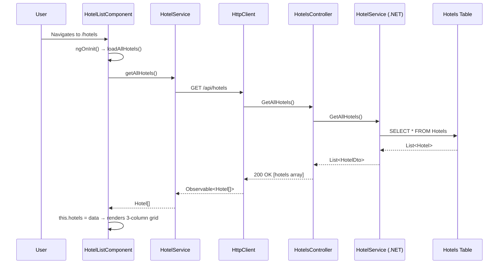

### Detailed Mapping

| Layer | File | Element | Details |
|-------|------|---------|---------|
| **Component** | `hotel-list.component.ts` | `HotelListComponent` | Landing page, two-column layout |
| **Frontend Model** | `hotel.model.ts` | `Hotel` | `{ hotelId, name, location, description }` |
| **Service** | `hotel.service.ts` | `getAllHotels()` | `GET /api/hotels` |
| **Interceptor** | `auth.interceptor.ts` | Conditional | Attaches JWT if token exists (but endpoint is public) |
| **Controller** | `HotelsController.cs` | `GET /api/hotels` | `[HttpGet]` — No `[Authorize]` |
| **Backend DTO** | `HotelDto.cs` | `HotelDto` | `{ HotelId, Name, Location, Description }` |
| **Backend Service** | `HotelService.cs` | `GetAllHotels()` | `_context.Hotels.Select(...)` |
| **DB Table** | `Hotels` | SELECT * | Full table scan |
| **Operation** | — | READ | Returns all hotels |

---

## 7. Feature 6: Search & Filter Rooms (Dynamic Filtering)

### Flow Diagram

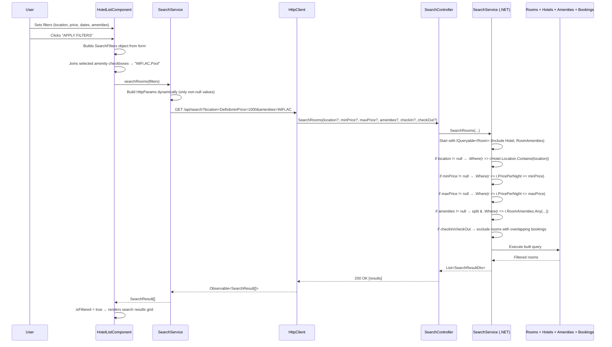

### Detailed Mapping

| Layer | File | Element | Details |
|-------|------|---------|---------|
| **Component** | `hotel-list.component.ts` | `applyFilters()` | Builds filters, calls search service |
| **Frontend Model** | `search.model.ts` | `SearchFilters` | `{ location?, minPrice?, maxPrice?, amenities?, checkIn?, checkOut? }` |
| **Frontend Model** | `search.model.ts` | `SearchResult` | `{ hotelId, hotelName, location, roomId, roomType, pricePerNight, capacity, amenities[] }` |
| **Service** | `search.service.ts` | `searchRooms()` | Builds `HttpParams` dynamically — only adds non-null params |
| **Controller** | `SearchController.cs` | `GET /api/search` | `[FromQuery]` for all 6 optional parameters |
| **Backend DTO** | `SearchResultDto.cs` | `SearchResultDto` | Flattened Hotel+Room view |
| **Backend Service** | `SearchService.cs` | `SearchRooms()` | Dynamic `IQueryable` — conditionally chains `.Where()` |
| **DB Tables** | `Rooms`, `Hotels`, `RoomAmenities`, `Amenities`, `Bookings` | JOINs | Multi-table query with Include |
| **Operation** | — | READ | Dynamic filtered SELECT with JOINs |

### Key Design Pattern: Dynamic Query Building

```csharp
// Start with base query
var query = _context.Rooms.Include(r => r.Hotel).Include(r => r.RoomAmenities).AsQueryable();

// Each filter is CONDITIONALLY applied
if (!string.IsNullOrEmpty(location))
    query = query.Where(r => r.Hotel.Location.Contains(location));

if (minPrice.HasValue)
    query = query.Where(r => r.PricePerNight >= minPrice.Value);
// ... and so on
```

This pattern means: if a user only fills "location" and "WiFi", only those two WHERE clauses are added. All other filters are skipped. This is the **Dynamic Filtering Engine**.

---

## 8. Feature 7: View Rooms by Hotel

### Flow Diagram

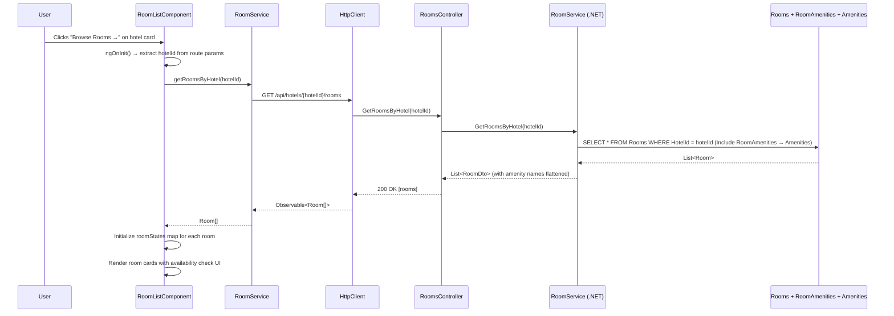

### Detailed Mapping

| Layer | File | Element | Details |
|-------|------|---------|---------|
| **Component** | `room-list.component.ts` | `RoomListComponent` | Per-room state management via `roomStates` map |
| **Frontend Model** | `room.model.ts` | `Room` | `{ roomId, hotelId, roomType, pricePerNight, capacity, isActive, amenities[] }` |
| **Service** | `room.service.ts` | `getRoomsByHotel()` | `GET /api/hotels/{hotelId}/rooms` |
| **Controller** | `RoomsController.cs` | `GET hotels/{hotelId}/rooms` | `[HttpGet("hotels/{hotelId}/rooms")]` |
| **Backend DTO** | `RoomDto.cs` | `RoomDto` | Includes `Amenities: List<string>` (flattened from M2M) |
| **Backend Service** | `RoomService.cs` | `GetRoomsByHotel()` | Includes `RoomAmenities` → maps amenity names |
| **DB Tables** | `Rooms`, `RoomAmenities`, `Amenities` | SELECT with JOINs | Many-to-Many via bridge table |
| **Operation** | — | READ | Filtered by HotelId |

---

## 9. Feature 8: Check Room Availability

### Flow Diagram

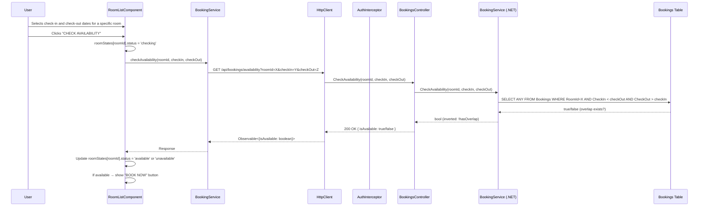

### Detailed Mapping

| Layer | File | Element | Details |
|-------|------|---------|---------|
| **Component** | `room-list.component.ts` | `checkAvailability()` | Per-room isolated state in `roomStates` map |
| **State Interface** | `room-list.component.ts` | `RoomState` | `{ checkIn, checkOut, status: 'idle'\|'checking'\|'available'\|'unavailable', isChecked }` |
| **Frontend Model** | `booking.model.ts` | `AvailabilityResponse` | `{ isAvailable: boolean }` |
| **Service** | `booking.service.ts` | `checkAvailability()` | `GET /api/bookings/availability?roomId=&checkIn=&checkOut=` |
| **Controller** | `BookingsController.cs` | `GET /api/bookings/availability` | `[FromQuery]` parameters — No `[Authorize]` |
| **Backend Service** | `BookingService.cs` | `CheckAvailability()` | Overlap formula: `existingCheckIn < reqCheckOut AND existingCheckOut > reqCheckIn` |
| **DB Table** | `Bookings` | SELECT (ANY) | Checks for date overlap with existing bookings |
| **Operation** | — | READ | Boolean result |

### Critical Logic: Date Overlap Detection

```
Overlap exists when:  existingCheckIn < requestedCheckOut
                AND   existingCheckOut > requestedCheckIn

Available = !overlap
```

Example: Room has booking Jan 10–15. User requests Jan 13–18. Overlap? `10 < 18 AND 15 > 13` → YES → Not available.

---

## 10. Feature 9: Create Booking

### Flow Diagram

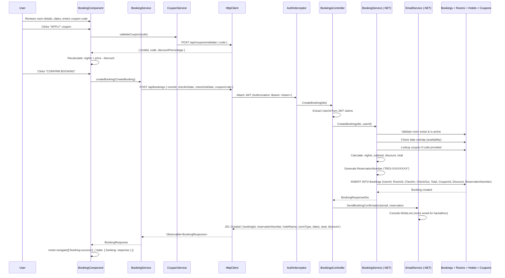

### Detailed Mapping

| Layer | File | Element | Details |
|-------|------|---------|---------|
| **Component** | `booking.component.ts` | `BookingComponent` | Two-column: form left, price summary right |
| **Frontend Model** | `booking.model.ts` | `CreateBooking` | `{ roomId, checkInDate, checkOutDate, couponCode? }` |
| **Frontend Model** | `booking.model.ts` | `BookingResponse` | `{ bookingId, reservationNumber, hotelName, roomType, dates, totalAmount, discountAmount, couponCode }` |
| **Frontend Model** | `coupon.model.ts` | `CouponResponse` | `{ isValid, code, discountPercentage }` |
| **Service** | `booking.service.ts` | `createBooking()` | `POST /api/bookings` |
| **Service** | `coupon.service.ts` | `validateCoupon()` | `POST /api/coupons/validate` |
| **Interceptor** | `auth.interceptor.ts` | **YES — Required** | Attaches `Authorization: Bearer <token>` |
| **Guard** | `auth.guard.ts` | **YES — Active** | Route `/booking/:roomId` protected by `authGuard` |
| **Controller** | `BookingsController.cs` | `POST /api/bookings` | `[Authorize]` — extracts `UserId` from JWT |
| **Backend DTO In** | `CreateBookingDto.cs` | `CreateBookingDto` | `{ RoomId, CheckInDate, CheckOutDate, CouponCode }` |
| **Backend DTO Out** | `BookingResponseDto.cs` | `BookingResponseDto` | Full booking confirmation |
| **Backend Service** | `BookingService.cs` | `CreateBooking()` | 10-step pipeline (validate → check overlap → coupon → calculate → insert) |
| **Backend Service** | `EmailService.cs` | `SendBookingConfirmation()` | Mock email (Console.WriteLine) |
| **DB Tables** | `Bookings`, `Rooms`, `Hotels`, `Coupons` | INSERT + SELECT | Creates booking row, reads room/hotel/coupon |
| **Operation** | — | CREATE | New row in Bookings table |

### Price Calculation Pipeline

```
1. nights = (checkOutDate - checkInDate).Days
2. subtotal = pricePerNight × nights
3. discount = subtotal × (couponPercentage / 100)   [if coupon valid]
4. total = subtotal - discount
5. reservationNumber = "RES-" + GUID(8 chars)
```

---

## 11. Feature 10: Booking Success & Email

### Flow (Frontend Only — No API Call)

```
BookingComponent navigates to /booking-success with Router state → { booking: BookingResponse }
    → BookingSuccessComponent.ngOnInit()
    → router.getCurrentNavigation().extras.state?.booking
    → If found → display booking details
    → Also saves to localStorage('last_booking') as refresh fallback
    → Shows animated checkmark + reservation details + action buttons
```

### Detailed Mapping

| Layer | File | Element | Details |
|-------|------|---------|---------|
| **Component** | `booking-success.component.ts` | `BookingSuccessComponent` | Centered success card |
| **Data Source** | Angular Router State | `navigation.extras.state` | Passed from BookingComponent |
| **Fallback** | `localStorage` | `last_booking` | JSON backup for page refresh |
| **Guard** | `auth.guard.ts` | **YES** | Route protected |
| **API Call** | — | None | Pure frontend display |

---

## 12. Feature 11: View My Bookings

### Flow Diagram

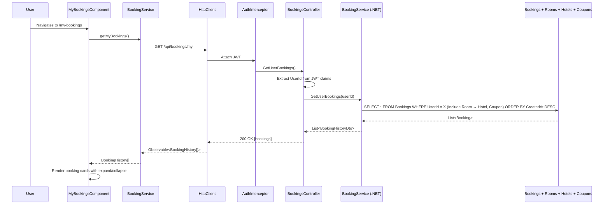

### Detailed Mapping

| Layer | File | Element | Details |
|-------|------|---------|---------|
| **Component** | `my-bookings.component.ts` | `MyBookingsComponent` | Expandable booking cards |
| **Frontend Model** | `booking.model.ts` | `BookingHistory` | `{ bookingId, reservationNumber, hotelName, hotelLocation, roomType, roomId, dates, totalAmount, discountAmount, couponCode, createdAt }` |
| **Service** | `booking.service.ts` | `getMyBookings()` | `GET /api/bookings/my` |
| **Interceptor** | `auth.interceptor.ts` | **YES — Required** | JWT identifies which user's bookings to fetch |
| **Guard** | `auth.guard.ts` | **YES** | Route protected |
| **Controller** | `BookingsController.cs` | `GET /api/bookings/my` | `[Authorize]` — extracts UserId from JWT |
| **Backend DTO** | `BookingHistoryDto.cs` | `BookingHistoryDto` | Full history with hotel location + createdAt |
| **Backend Service** | `BookingService.cs` | `GetUserBookings()` | Multi-include query, ordered by latest first |
| **DB Tables** | `Bookings`, `Rooms`, `Hotels`, `Coupons` | SELECT with JOINs | Filtered by UserId |
| **Operation** | — | READ | User-specific booking history |

---

## 13. Feature 12: Quick Rebook

### Flow

```
User clicks "🔄 Quick Rebook" on a booking card
    → MyBookingsComponent.quickRebook(booking)
    → router.navigate(['/booking', booking.roomId])
    → BookingComponent loads with roomId
    → User selects new dates → checks availability → confirms new booking
```

### Explanation

1. **No API call for rebook itself** — It simply navigates to the booking page with the same `roomId`
2. **User must pick new dates** — The booking page opens fresh (without pre-filled dates)
3. **Full booking flow repeats** — Availability check → optional coupon → confirm → new booking created
4. **The original booking is NOT cancelled** — Rebook creates a NEW booking for the same room

---

## 14. Feature 13: Admin — Add Hotel

### Flow Diagram

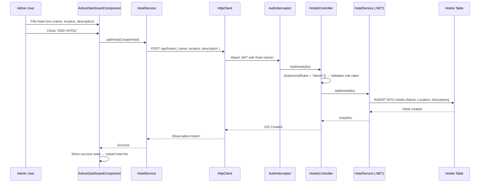

### Detailed Mapping

| Layer | File | Element | Details |
|-------|------|---------|---------|
| **Component** | `admin-dashboard.component.ts` | `addHotel()` | Hotels tab in admin panel |
| **Frontend Model** | `hotel.model.ts` | `CreateHotel` | `{ name, location, description }` |
| **Service** | `hotel.service.ts` | `addHotel()` | `POST /api/hotels` |
| **Interceptor** | `auth.interceptor.ts` | **YES — Required** | JWT must contain `Role: "Admin"` |
| **Guard** | `admin.guard.ts` | **YES** | Route `/admin` protected by `adminGuard` |
| **Controller** | `HotelsController.cs` | `POST /api/hotels` | `[Authorize(Roles = "Admin")]` |
| **Backend DTO** | `CreateHotelDto.cs` | `CreateHotelDto` | `{ Name, Location, Description }` |
| **Backend Service** | `HotelService.cs` | `AddHotel()` | Maps DTO → Hotel entity → INSERT |
| **DB Table** | `Hotels` | INSERT | New hotel row |
| **Operation** | — | CREATE | Admin-only |

---

## 15. Feature 14: Admin — Add Room

### Flow Diagram

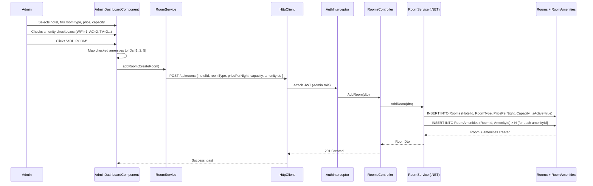

### Detailed Mapping

| Layer | File | Element | Details |
|-------|------|---------|---------|
| **Component** | `admin-dashboard.component.ts` | `addRoom()` | Rooms tab, amenity checkboxes |
| **Amenity Mapping** | `admin-dashboard.component.ts` | `amenityMap` | `{ WiFi: 1, AC: 2, TV: 3, Pool: 4, Gym: 5, Parking: 6, Restaurant: 7, 'Mini Bar': 8 }` |
| **Frontend Model** | `room.model.ts` | `CreateRoom` | `{ hotelId, roomType, pricePerNight, capacity, amenityIds[] }` |
| **Service** | `room.service.ts` | `addRoom()` | `POST /api/rooms` |
| **Interceptor** | `auth.interceptor.ts` | **YES — Required** | Admin JWT |
| **Controller** | `RoomsController.cs` | `POST /api/rooms` | `[Authorize(Roles = "Admin")]` |
| **Backend DTO** | `CreateRoomDto.cs` | `CreateRoomDto` | Includes `AmenityIds: List<int>` |
| **Backend Service** | `RoomService.cs` | `AddRoom()` | Creates Room + RoomAmenity bridge rows |
| **DB Tables** | `Rooms`, `RoomAmenities` | INSERT × 2 | Room row + M2M bridge table rows |
| **Operation** | — | CREATE | Two-table insert |

---

## 16. Feature 15: Admin — Create Coupon

### Detailed Mapping

| Layer | File | Element | Details |
|-------|------|---------|---------|
| **Component** | `admin-dashboard.component.ts` | `createCoupon()` | Coupons tab |
| **Frontend Model** | `coupon.model.ts` | `CreateCoupon` | `{ code, discountPercentage, expiryDate }` |
| **Service** | `coupon.service.ts` | `createCoupon()` | `POST /api/coupons` |
| **Interceptor** | `auth.interceptor.ts` | **YES** | Admin JWT required |
| **Controller** | `CouponsController.cs` | `POST /api/coupons` | `[Authorize(Roles = "Admin")]` |
| **Backend DTO** | `CreateCouponDto.cs` | `CreateCouponDto` | `{ Code, DiscountPercentage (1-100), ExpiryDate }` |
| **Backend Service** | `CouponService.cs` | `CreateCoupon()` | INSERT with `IsActive = true` |
| **DB Table** | `Coupons` | INSERT | New coupon row |
| **Operation** | — | CREATE | Admin-only |

---

## 17. Feature 16: Admin — Toggle Coupon

### Detailed Mapping

| Layer | File | Element | Details |
|-------|------|---------|---------|
| **Component** | `admin-dashboard.component.ts` | `toggleCoupon()` | Coupons tab |
| **Service** | `coupon.service.ts` | `toggleCoupon()` | `PUT /api/coupons/{id}/toggle` |
| **Controller** | `CouponsController.cs` | `PUT /{id}/toggle` | `[Authorize(Roles = "Admin")]` |
| **Backend Service** | `CouponService.cs` | `ToggleCoupon()` | Flips `IsActive` between `true` ↔ `false` |
| **DB Table** | `Coupons` | UPDATE | Toggles `IsActive` column |
| **Operation** | — | UPDATE | Admin-only |

---

## 18. Feature 17: Validate Coupon

### Detailed Mapping

| Layer | File | Element | Details |
|-------|------|---------|---------|
| **Component** | `booking.component.ts` | `applyCoupon()` | Coupon input in booking form |
| **Frontend Model** | `coupon.model.ts` | `CouponResponse` | `{ isValid, code, discountPercentage }` |
| **Service** | `coupon.service.ts` | `validateCoupon()` | `POST /api/coupons/validate { code }` |
| **Interceptor** | `auth.interceptor.ts` | **YES** | User must be logged in |
| **Controller** | `CouponsController.cs` | `POST /validate` | `[Authorize]` (any logged-in user) |
| **Backend DTO In** | `ValidateCouponDto.cs` | `ValidateCouponDto` | `{ Code }` |
| **Backend DTO Out** | `CouponResponseDto.cs` | `CouponResponseDto` | `{ IsValid, Code, DiscountPercentage }` |
| **Backend Service** | `CouponService.cs` | `ValidateCoupon()` | Checks: exists? → active? → not expired? |
| **DB Table** | `Coupons` | SELECT | Read-only validation |
| **Operation** | — | READ | Returns validity status |

### Validation Logic

```
1. Find coupon by code (case-insensitive)
2. Not found → { isValid: false }
3. Found but IsActive = false → { isValid: false }
4. Found but ExpiryDate < today → { isValid: false }
5. All checks pass → { isValid: true, code, discountPercentage }
```

---

## 19. Feature 18: Route Protection (Guards)

### Auth Guard Flow

```
User navigates to protected route (e.g., /my-bookings)
    → Angular Router calls authGuard(route, state)
    → inject(AuthService) → check isLoggedIn() signal
    → If true → return true → allow navigation
    → If false → router.navigate(['/login']) → return false → block
```

### Admin Guard Flow

```
User navigates to /admin
    → Angular Router calls adminGuard(route, state)
    → inject(AuthService)
    → Step 1: isLoggedIn()? → If false → redirect to /login
    → Step 2: isAdmin()? → If false → redirect to /hotels
    → Step 3: Both true → return true → allow navigation
```

### Protected Routes Summary

| Route | Guard | Who Can Access |
|-------|-------|---------------|
| `/login` | None | Everyone |
| `/register` | None | Everyone |
| `/hotels` | None | Everyone |
| `/hotels/:id/rooms` | None | Everyone |
| `/booking/:roomId` | `authGuard` | Logged-in users |
| `/booking-success` | `authGuard` | Logged-in users |
| `/my-bookings` | `authGuard` | Logged-in users |
| `/admin` | `adminGuard` | Admins only |

---

## 20. Feature 19: JWT Token Injection (Interceptor)

### Interceptor Flow

```
Angular HttpClient fires any HTTP request
    → authInterceptor(req, next) is called
    → inject(AuthService) → getToken() from localStorage
    → If token exists:
        → Clone request with header: Authorization: Bearer <token>
        → return next(clonedRequest)
    → If no token:
        → return next(req) as-is (unauthenticated request)
```

### Which Endpoints Need the Interceptor?

| Endpoint | Needs JWT? | Backend Attribute |
|----------|-----------|-------------------|
| `POST /api/auth/register` | ❌ No | None |
| `POST /api/auth/login` | ❌ No | None |
| `GET /api/hotels` | ❌ No | None |
| `GET /api/hotels/{id}/rooms` | ❌ No | None |
| `GET /api/search` | ❌ No | None |
| `GET /api/bookings/availability` | ❌ No | None |
| `POST /api/bookings` | ✅ Yes | `[Authorize]` |
| `GET /api/bookings/my` | ✅ Yes | `[Authorize]` |
| `POST /api/bookings/rebook/{id}` | ✅ Yes | `[Authorize]` |
| `POST /api/coupons/validate` | ✅ Yes | `[Authorize]` |
| `POST /api/coupons` | ✅ Yes (Admin) | `[Authorize(Roles = "Admin")]` |
| `PUT /api/coupons/{id}/toggle` | ✅ Yes (Admin) | `[Authorize(Roles = "Admin")]` |
| `POST /api/hotels` | ✅ Yes (Admin) | `[Authorize(Roles = "Admin")]` |
| `POST /api/rooms` | ✅ Yes (Admin) | `[Authorize(Roles = "Admin")]` |

---

## 21. Feature 20: Global Exception Handling (Middleware)

### Middleware Flow

```
Any HTTP request enters ASP.NET pipeline
    → GlobalExceptionMiddleware.InvokeAsync(context)
    → try { await _next(context) }
    → catch (KeyNotFoundException) → 404 { error: message }
    → catch (UnauthorizedAccessException) → 401 { error: message }
    → catch (InvalidOperationException) → 400 { error: message }
    → catch (ArgumentException) → 400 { error: message }
    → catch (Exception) → 500 { error: "Something went wrong" }
    → All exceptions logged to Console.WriteLine
```

This middleware sits **first in the pipeline** (before CORS, Auth, Controllers) and catches ALL unhandled exceptions, returning standardized JSON error responses.

---

## 22. Database Schema Reference

### Entity Relationship Diagram

```mermaid
erDiagram
    Users ||--o{ Bookings : "has many"
    Hotels ||--o{ Rooms : "has many"
    Rooms ||--o{ Bookings : "has many"
    Rooms ||--o{ RoomAmenities : "has many"
    Amenities ||--o{ RoomAmenities : "has many"
    Coupons ||--o{ Bookings : "applied to"

    Users {
        int UserId PK
        string Name
        string Email UK
        string PasswordHash
        string Role
        datetime CreatedAt
    }

    Hotels {
        int HotelId PK
        string Name
        string Location
        string Description
    }

    Rooms {
        int RoomId PK
        int HotelId FK
        string RoomType
        decimal PricePerNight
        int Capacity
        bool IsActive
    }

    Amenities {
        int AmenityId PK
        string Name
    }

    RoomAmenities {
        int RoomId FK_PK
        int AmenityId FK_PK
    }

    Bookings {
        int BookingId PK
        int UserId FK
        int RoomId FK
        datetime CheckInDate
        datetime CheckOutDate
        decimal TotalAmount
        int CouponId FK_nullable
        decimal DiscountAmount
        string ReservationNumber
        datetime CreatedAt
    }

    Coupons {
        int CouponId PK
        string Code UK
        decimal DiscountPercentage
        datetime ExpiryDate
        bool IsActive
    }
```

### Table Operations Summary

| Table | CREATE | READ | UPDATE | DELETE |
|-------|--------|------|--------|--------|
| `Users` | Register | Login, JWT extraction | Admin role (manual SQL) | — |
| `Hotels` | Admin: Add Hotel | List all, Search | — | — |
| `Rooms` | Admin: Add Room | List by hotel, Search, Availability | — | — |
| `Amenities` | Pre-seeded | Search filter, Room display | — | — |
| `RoomAmenities` | Admin: Add Room (auto) | Room display, Search | — | — |
| `Bookings` | Create Booking | My Bookings, Availability Check, Rebook | — | — |
| `Coupons` | Admin: Create | Validate, Booking | Toggle (IsActive) | — |

---

> **Document Version:** 1.0 | **System:** StayEase Hotel Booking System | **Stack:** Angular 19 + ASP.NET 8 + MySQL
