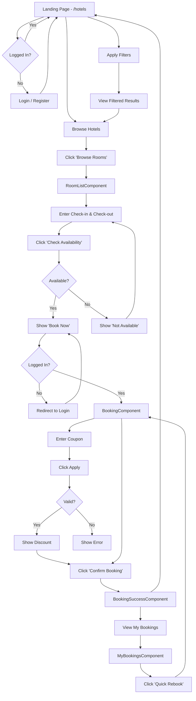
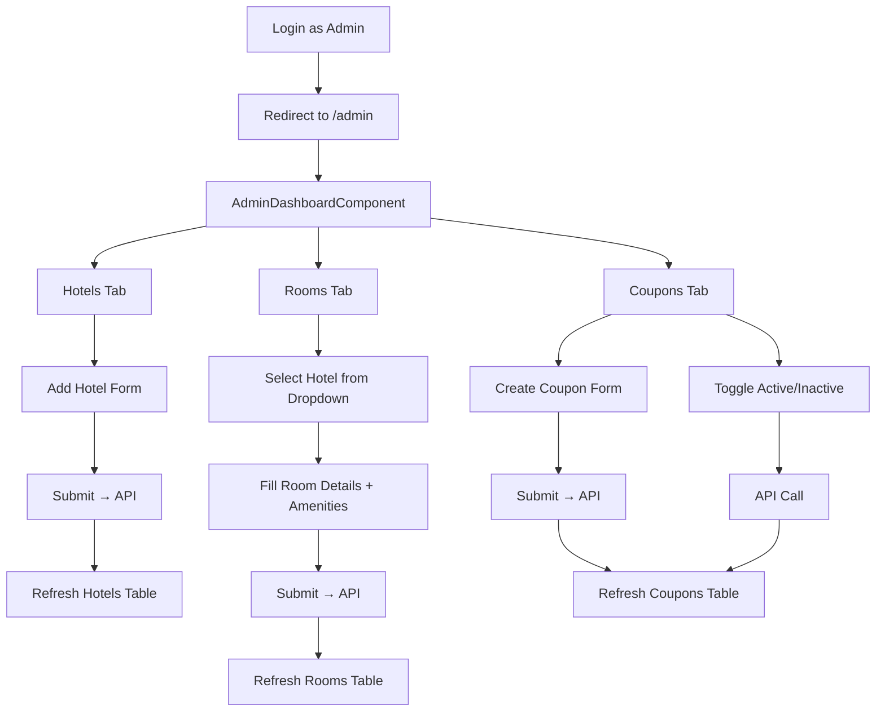

# 🎨 Hotel Booking System — Complete UI Design Plan

> **Framework:** Angular 21  
> **Design Style:** Modern, Premium, Dark-themed with Accent Gradients  
> **Font:** Inter (Google Fonts)  
> **Total Components:** 9  
> **Total Pages/Routes:** 8

---

## 1. Design System & Visual Identity

### 1.1 Color Palette

| Token | Color | Hex | Usage |
|-------|-------|-----|-------|
| `--bg-primary` | Deep Navy | `#0f172a` | Page background |
| `--bg-secondary` | Dark Slate | `#1e293b` | Card backgrounds, modals |
| `--bg-tertiary` | Slate | `#334155` | Input fields, hover states |
| `--accent-primary` | Royal Blue | `#3b82f6` | Primary buttons, active states, links |
| `--accent-secondary` | Emerald | `#10b981` | Success messages, available badges |
| `--accent-warning` | Amber | `#f59e0b` | Warnings, coupon highlights |
| `--accent-danger` | Rose | `#ef4444` | Errors, unavailable badges, delete actions |
| `--text-primary` | White | `#f8fafc` | Headings, primary text |
| `--text-secondary` | Light Gray | `#94a3b8` | Descriptions, labels |
| `--text-muted` | Gray | `#64748b` | Placeholder text, disabled |
| `--border` | Subtle Gray | `#334155` | Card borders, dividers |
| `--gradient-primary` | Blue→Purple | `linear-gradient(135deg, #3b82f6, #8b5cf6)` | CTA buttons, hero sections |
| `--gradient-gold` | Amber→Orange | `linear-gradient(135deg, #f59e0b, #ef4444)` | Promotion badges, coupon highlights |

### 1.2 Typography

| Element | Font | Weight | Size |
|---------|------|--------|------|
| H1 (Page titles) | Inter | 700 (Bold) | 32px |
| H2 (Section titles) | Inter | 600 (Semi-bold) | 24px |
| H3 (Card titles) | Inter | 600 | 18px |
| Body text | Inter | 400 (Regular) | 14px |
| Labels / Captions | Inter | 500 (Medium) | 12px |
| Buttons | Inter | 600 | 14px |

### 1.3 Component Design Tokens

| Element | Style |
|---------|-------|
| Cards | `bg-secondary`, `border-radius: 16px`, `border: 1px solid var(--border)`, subtle `box-shadow` |
| Buttons (Primary) | `gradient-primary`, `border-radius: 10px`, `padding: 12px 24px`, hover: slight scale + glow |
| Buttons (Secondary) | `bg-tertiary` with `text-primary`, `border-radius: 10px` |
| Buttons (Danger) | `accent-danger` background |
| Input Fields | `bg-tertiary`, `border: 1px solid var(--border)`, `border-radius: 8px`, focus: `accent-primary` border glow |
| Badges | Small rounded pill, colored background with matching text |
| Tooltips | Dark with white text, appears on hover |
| Spinners | Rotating ring in `accent-primary` color |

### 1.4 Spacing & Layout

| Token | Value | Usage |
|-------|-------|-------|
| `--space-xs` | 4px | Tight gaps |
| `--space-sm` | 8px | Inside elements |
| `--space-md` | 16px | Between elements |
| `--space-lg` | 24px | Section padding |
| `--space-xl` | 32px | Page-level spacing |
| `--space-2xl` | 48px | Major section separation |
| Max content width | 1280px | Container max-width |
| Card grid gap | 24px | Between cards |

### 1.5 Animations & Micro-interactions

| Animation | Where | Detail |
|-----------|-------|--------|
| Fade-in-up | Page load | Elements slide up 20px + fade in (300ms) |
| Card hover lift | Hotel/Room cards | `translateY(-4px)` + enhanced shadow (200ms) |
| Button pulse | CTA buttons | Subtle scale 1.02 on hover (150ms) |
| Skeleton shimmer | Loading states | Gray shimmer blocks before data loads |
| Slide-in | Filter panel | Slides from left on mobile (300ms) |
| Toast slide-in | Success/Error messages | Slides in from top-right, auto-dismisses (3s) |
| Input focus glow | All inputs | Blue border glow on focus (200ms) |
| Badge pulse | "Available" badge | Subtle pulsing green dot |
| Strikethrough | Original price | CSS strikethrough when coupon applied |

---

## 2. Global Layout

Every page shares a consistent structure:

```
┌──────────────────────────────────────────────────────────┐
│                    NAVBAR (Fixed Top)                     │
│  [Logo + Title]     [Search Bar]      [Nav Links] [Auth] │
├──────────────────────────────────────────────────────────┤
│                                                          │
│                   PAGE CONTENT AREA                       │
│                 (max-width: 1280px)                       │
│                  (centered, padded)                       │
│                                                          │
│                                                          │
└──────────────────────────────────────────────────────────┘
```

### Responsive Breakpoints

| Breakpoint | Width | Layout Change |
|------------|-------|---------------|
| Desktop | ≥ 1024px | Full layout, 3-4 column card grid |
| Tablet | 768–1023px | 2 column card grid, hamburger nav |
| Mobile | < 768px | 1 column card grid, stacked layout, hamburger nav |

---

## 3. Component-by-Component Design

---

### 🔐 3.1 LoginComponent — `/login`

**Purpose:** Authenticate existing users

#### Layout

```
┌──────────────────────────────────────────────────────────┐
│                      NAVBAR                              │
├──────────────────────────────────────────────────────────┤
│                                                          │
│         ┌──────────────────────────────────┐             │
│         │        🏨 Welcome Back           │             │
│         │     Sign in to your account      │             │
│         │                                  │             │
│         │  ┌────────────────────────────┐  │             │
│         │  │ 📧  Email                  │  │             │
│         │  └────────────────────────────┘  │             │
│         │                                  │             │
│         │  ┌────────────────────────────┐  │             │
│         │  │ 🔒  Password          [👁]  │  │             │
│         │  └────────────────────────────┘  │             │
│         │                                  │             │
│         │  ┌────────────────────────────┐  │             │
│         │  │       🔵 SIGN IN           │  │             │
│         │  └────────────────────────────┘  │             │
│         │                                  │             │
│         │  Don't have an account?          │             │
│         │  → Register here                 │             │
│         └──────────────────────────────────┘             │
│                                                          │
└──────────────────────────────────────────────────────────┘
```

#### UI Elements

| Element | Type | Detail |
|---------|------|--------|
| Card container | `div` | Centered, `max-width: 420px`, `bg-secondary`, rounded-16, shadow |
| Title | `h1` | "Welcome Back" — bold, white |
| Subtitle | `p` | "Sign in to your account" — `text-secondary` |
| Email input | `<input type="email">` | Icon prefix, placeholder "Enter your email" |
| Password input | `<input type="password">` | Icon prefix, toggle visibility button |
| Submit button | `<button>` | Full width, `gradient-primary`, "SIGN IN" |
| Register link | `<a routerLink>` | "Don't have an account? Register here" — `accent-primary` |
| Error message | `<div>` | Below form, red text, shows on invalid credentials |
| Loading state | Spinner inside button | Button text → spinner while API call in progress |

#### Behavior

| Action | What Happens |
|--------|-------------|
| Click "SIGN IN" | Validate form → Call `AuthService.login()` → Store JWT → Redirect to `/hotels` |
| Invalid credentials | Show "Invalid email or password" in red below form |
| Empty fields | Show field-level validation errors ("Email is required") |
| Click "Register here" | Navigate to `/register` |
| Already logged in | Auto-redirect to `/hotels` |

---

### 🔐 3.2 RegisterComponent — `/register`

**Purpose:** Create new user account

#### Layout

```
┌──────────────────────────────────────────────────────────┐
│                      NAVBAR                              │
├──────────────────────────────────────────────────────────┤
│                                                          │
│         ┌──────────────────────────────────┐             │
│         │       🏨 Create Account          │             │
│         │    Join us to start booking      │             │
│         │                                  │             │
│         │  ┌────────────────────────────┐  │             │
│         │  │ 👤  Full Name              │  │             │
│         │  └────────────────────────────┘  │             │
│         │                                  │             │
│         │  ┌────────────────────────────┐  │             │
│         │  │ 📧  Email                  │  │             │
│         │  └────────────────────────────┘  │             │
│         │                                  │             │
│         │  ┌────────────────────────────┐  │             │
│         │  │ 🔒  Password          [👁]  │  │             │
│         │  └────────────────────────────┘  │             │
│         │                                  │             │
│         │  ┌────────────────────────────┐  │             │
│         │  │ 🔒  Confirm Password  [👁]  │  │             │
│         │  └────────────────────────────┘  │             │
│         │                                  │             │
│         │  ┌────────────────────────────┐  │             │
│         │  │      🔵 CREATE ACCOUNT     │  │             │
│         │  └────────────────────────────┘  │             │
│         │                                  │             │
│         │  Already have an account?        │             │
│         │  → Sign in here                  │             │
│         └──────────────────────────────────┘             │
│                                                          │
└──────────────────────────────────────────────────────────┘
```

#### UI Elements

| Element | Type | Detail |
|---------|------|--------|
| Name input | `<input type="text">` | Placeholder "Enter your full name" |
| Email input | `<input type="email">` | Validate email format |
| Password input | `<input type="password">` | Min 6 chars, toggle visibility |
| Confirm password | `<input type="password">` | Must match password |
| Submit button | `<button>` | Full width, `gradient-primary` |
| Login link | `<a routerLink>` | Links to `/login` |

#### Validations

| Field | Rule | Error Message |
|-------|------|---------------|
| Name | Required, min 2 chars | "Name is required" |
| Email | Required, valid format | "Enter a valid email" |
| Password | Required, min 6 chars | "Password must be at least 6 characters" |
| Confirm Password | Must match password | "Passwords do not match" |

#### Behavior

| Action | What Happens |
|--------|-------------|
| Click "CREATE ACCOUNT" | Validate → Call `AuthService.register()` → Show success toast → Redirect to `/login` |
| Email already exists | Show "Email already registered" error |

---

### 🧭 3.3 NavbarComponent — (Global, every page)

**Purpose:** Navigation, search, auth state display

#### Layout

```
┌──────────────────────────────────────────────────────────────────────────┐
│  🏨 StayEase     [🔍 Search hotels by location...]    Hotels │ My Bookings │ [Login] │
└──────────────────────────────────────────────────────────────────────────┘

When logged in (User):
┌──────────────────────────────────────────────────────────────────────────┐
│  🏨 StayEase     [🔍 Search hotels by location...]    Hotels │ My Bookings │ 👤 Vaibhav ▾ │
│                                                                          │    [Logout]    │
└──────────────────────────────────────────────────────────────────────────┘

When logged in (Admin):
┌──────────────────────────────────────────────────────────────────────────┐
│  🏨 StayEase     [🔍 Search hotels by location...]    Hotels │ Admin Panel │ 👤 Admin ▾  │
│                                                                          │   [Logout]    │
└──────────────────────────────────────────────────────────────────────────┘
```

#### UI Elements

| Element | Detail |
|---------|--------|
| Logo + Brand | "🏨 StayEase" — bold, white, clickable → `/hotels` |
| Search bar | Text input with search icon, placeholder "Search hotels by location...", width ~300px |
| Nav links | **Hotels** (always visible), **My Bookings** (visible when logged in as User), **Admin Panel** (visible when logged in as Admin) |
| Auth button (not logged in) | "Login" button — outlined style, links to `/login` |
| User dropdown (logged in) | Shows user name + avatar icon, dropdown with "Logout" option |
| Mobile hamburger | ☰ icon on mobile, opens slide-in side nav |

#### Behavior

| Action | What Happens |
|--------|-------------|
| Type in search bar + Enter | Navigate to `/hotels` with `?location=<value>` → triggers filter on HotelListComponent |
| Click "Hotels" | Navigate to `/hotels` |
| Click "My Bookings" | Navigate to `/my-bookings` (requires login) |
| Click "Admin Panel" | Navigate to `/admin` (admin only) |
| Click "Logout" | Clear JWT + redirect to `/login` |

#### Responsive (Mobile)

| Change | Detail |
|--------|--------|
| Nav links | Hidden → hamburger menu |
| Search bar | Collapses to icon → Click to expand |
| Brand text | Shortened to icon only |

---

### 🏨 3.4 HotelListComponent — `/hotels` (MAIN PAGE)

**Purpose:** Browse all hotels + integrated search & filter + display results as cards

#### Layout

```
┌──────────────────────────────────────────────────────────────────────┐
│                            NAVBAR                                    │
├──────────────────────────────────────────────────────────────────────┤
│                                                                      │
│  ┌─── FILTER SIDEBAR ───┐  ┌──────── HOTEL GRID ────────────────┐  │
│  │                       │  │                                    │  │
│  │  📍 Location          │  │  ┌──────────┐  ┌──────────┐       │  │
│  │  [Dropdown / Input ]  │  │  │  HOTEL    │  │  HOTEL    │      │  │
│  │                       │  │  │  CARD 1   │  │  CARD 2   │      │  │
│  │  💰 Price Range       │  │  │           │  │           │      │  │
│  │  [Min] ── [Max]       │  │  │ [Browse]  │  │ [Browse]  │      │  │
│  │                       │  │  └──────────┘  └──────────┘       │  │
│  │  📅 Check-in Date     │  │                                    │  │
│  │  [Date Picker]        │  │  ┌──────────┐  ┌──────────┐       │  │
│  │                       │  │  │  HOTEL    │  │  HOTEL    │      │  │
│  │  📅 Check-out Date    │  │  │  CARD 3   │  │  CARD 4   │      │  │
│  │  [Date Picker]        │  │  │           │  │           │      │  │
│  │                       │  │  │ [Browse]  │  │ [Browse]  │      │  │
│  │  🧾 Amenities         │  │  └──────────┘  └──────────┘       │  │
│  │  ☑ WiFi               │  │                                    │  │
│  │  ☑ AC                 │  │  ── Results: 12 hotels found ──   │  │
│  │  ☑ Pool               │  │                                    │  │
│  │  ☐ Gym                │  │                                    │  │
│  │  ☐ Parking            │  │                                    │  │
│  │                       │  │                                    │  │
│  │  ┌─────────────────┐  │  │                                    │  │
│  │  │  🔵 APPLY FILTER │  │  │                                    │  │
│  │  └─────────────────┘  │  │                                    │  │
│  │                       │  │                                    │  │
│  │  [Clear All Filters]  │  │                                    │  │
│  └───────────────────────┘  └────────────────────────────────────┘  │
│                                                                      │
└──────────────────────────────────────────────────────────────────────┘
```

#### Filter Sidebar Elements

| Element | Type | Detail |
|---------|------|--------|
| Location dropdown | `<select>` or text input | List of available locations OR free text |
| Price range — Min | `<input type="number">` | Placeholder "Min ₹" |
| Price range — Max | `<input type="number">` | Placeholder "Max ₹" |
| Check-in date | `<input type="date">` | Cannot be in the past |
| Check-out date | `<input type="date">` | Must be after check-in |
| Amenities | Checkboxes | WiFi, AC, Pool, Gym, Parking, TV, Restaurant — user selects multiple |
| "APPLY FILTER" button | `<button>` | `gradient-primary`, triggers search API |
| "Clear All Filters" link | `<a>` | Resets all fields, reloads all hotels |

#### Hotel Card Design

```
┌──────────────────────────────┐
│  ┌────────────────────────┐  │
│  │                        │  │
│  │    HOTEL IMAGE          │  │
│  │    (placeholder/        │  │
│  │     gradient bg)        │  │
│  │                        │  │
│  └────────────────────────┘  │
│                              │
│  Taj Palace Hotel            │  ← h3, bold, white
│  📍 Delhi, India             │  ← text-secondary
│                              │
│  A luxury 5-star hotel       │  ← description, 2 lines max
│  with world-class amenities  │    (text-muted, truncated)
│                              │
│  ┌────────────────────────┐  │
│  │  🔵 BROWSE ROOMS →     │  │  ← gradient button
│  └────────────────────────┘  │
└──────────────────────────────┘
```

| Element | Detail |
|---------|--------|
| Image area | Gradient placeholder (hotel-themed background) or generated image, `height: 180px`, rounded top |
| Hotel name | `h3`, white, bold |
| Location | Text with 📍 icon, `text-secondary` |
| Description | 2 lines max, `text-overflow: ellipsis` |
| "BROWSE ROOMS" button | Full width, `gradient-primary`, navigates to `/hotels/:id/rooms` |

#### Grid Layout

| Breakpoint | Columns |
|------------|---------|
| Desktop (≥1024px) | 3 columns |
| Tablet (768–1023px) | 2 columns |
| Mobile (<768px) | 1 column (filter sidebar collapses to top accordion) |

#### Behavior

| Action | What Happens |
|--------|-------------|
| Page loads | Call `HotelService.getAllHotels()` → Display all hotels, show skeleton loaders while loading |
| User selects filters + clicks "APPLY" | Call `SearchService.searchRooms(filters)` → Update grid with results |
| No results | Show empty state: "No hotels match your criteria. Try adjusting your filters." |
| Click "BROWSE ROOMS" on card | Navigate to `/hotels/:hotelId/rooms` |
| Search from navbar | Pre-fills location filter, auto-triggers search |
| Mobile view | Filter sidebar collapses above grid as expandable accordion |

#### States

| State | Display |
|-------|---------|
| Loading | 6 skeleton card placeholders with shimmer animation |
| Loaded | Hotel cards grid |
| Empty | Illustration + "No hotels found" message |
| Error | Error toast message |
| Filtered | Results count shown: "Showing 5 of 12 hotels" |

---

### 🛏️ 3.5 RoomListComponent — `/hotels/:hotelId/rooms`

**Purpose:** Show rooms of selected hotel, check availability, trigger booking

#### Layout

```
┌──────────────────────────────────────────────────────────────────────┐
│                            NAVBAR                                    │
├──────────────────────────────────────────────────────────────────────┤
│                                                                      │
│  ← Back to Hotels                                                    │
│                                                                      │
│  ┌────────────────────────────────────────────────────────────────┐  │
│  │  🏨 Taj Palace Hotel                                          │  │
│  │  📍 Delhi, India                                               │  │
│  │  A luxury 5-star hotel with world-class amenities and spa...   │  │
│  └────────────────────────────────────────────────────────────────┘  │
│                                                                      │
│  AVAILABLE ROOMS (4)                                                 │
│                                                                      │
│  ┌────────────────────────────────────────────────────────────────┐  │
│  │                         ROOM CARD 1                            │  │
│  │                                                                │  │
│  │  🛏️ Deluxe Room         ₹2,500/night       👤 2 Guests       │  │
│  │                                                                │  │
│  │  Amenities: [WiFi] [AC] [TV] [Mini Bar]                       │  │
│  │                                                                │  │
│  │  ┌──────────────┐  ┌──────────────┐  ┌──────────────────────┐ │  │
│  │  │ Check-in 📅   │  │ Check-out 📅  │  │ ⬜ CHECK AVAILABILITY │ │  │
│  │  │ [2026-04-10] │  │ [2026-04-12] │  │     (disabled)       │ │  │
│  │  └──────────────┘  └──────────────┘  └──────────────────────┘ │  │
│  │                                                                │  │
│  │  ── After availability check ──                                │  │
│  │                                                                │  │
│  │  ✅ Room is available!              ┌────────────────────┐    │  │
│  │                                     │  🔵 BOOK NOW →     │    │  │
│  │                                     └────────────────────┘    │  │
│  │                                                                │  │
│  │  ── OR if not available ──                                     │  │
│  │                                                                │  │
│  │  ❌ Room is not available for selected dates                   │  │
│  │                                                                │  │
│  └────────────────────────────────────────────────────────────────┘  │
│                                                                      │
│  ┌────────────────────────────────────────────────────────────────┐  │
│  │                         ROOM CARD 2                            │  │
│  │  (same structure as above)                                    │  │
│  └────────────────────────────────────────────────────────────────┘  │
│                                                                      │
└──────────────────────────────────────────────────────────────────────┘
```

#### Room Card Elements

| Element | Type | Detail |
|---------|------|--------|
| Room type | `h3` | "Deluxe Room", "Standard Room", etc. — bold, white |
| Price | `span` | "₹2,500/night" — large, `accent-primary`, bold |
| Capacity | `span` | "👤 2 Guests" — `text-secondary` |
| Amenities | Badge pills | Each amenity as a small pill: `[WiFi]` `[AC]` `[TV]` — `bg-tertiary`, rounded |
| Check-in date | `<input type="date">` | Min = today |
| Check-out date | `<input type="date">` | Min = check-in + 1 day |
| "CHECK AVAILABILITY" button | `<button>` | **Disabled** until both dates entered → **Enabled** with `accent-primary` background |
| Availability result ✅ | `<div>` | Green text: "Room is available!" + green dot animation |
| Availability result ❌ | `<div>` | Red text: "Room is not available for selected dates" |
| "BOOK NOW" button | `<button>` | Only appears when available, `gradient-primary`, navigates to `/booking/:roomId` with dates as query params |

#### Behavior (CRITICAL — YOUR EXACT REQUIREMENT)

| Action | What Happens |
|--------|-------------|
| Page loads | Call `RoomService.getRoomsByHotel(hotelId)` → Display all rooms |
| Dates NOT entered | "CHECK AVAILABILITY" button is **disabled** (grayed out) |
| Both dates entered | "CHECK AVAILABILITY" button becomes **enabled** (blue) |
| Click "CHECK AVAILABILITY" | Call `BookingService.checkAvailability(roomId, checkIn, checkOut)` → Show spinner on button |
| Room IS available | Show ✅ "Room is available!" in green + Show "BOOK NOW" button + Disable "CHECK AVAILABILITY" |
| Room is NOT available | Show ❌ "Room is not available for selected dates" in red + Do NOT show "BOOK NOW" button |
| Change dates after check | Reset availability state → hide BOOK NOW → re-enable CHECK AVAILABILITY |
| Click "BOOK NOW" | If logged in → navigate to `/booking/:roomId?checkIn=...&checkOut=...`. If NOT logged in → redirect to `/login` with return URL |
| "← Back to Hotels" | Navigate back to `/hotels` |

#### States per Room Card

| State | Visual |
|-------|--------|
| Initial (no dates) | Dates empty, CHECK AVAILABILITY disabled, no result shown |
| Dates entered | CHECK AVAILABILITY enabled (blue) |
| Checking | Spinner inside CHECK AVAILABILITY button |
| Available | ✅ green message + BOOK NOW visible + CHECK AVAILABILITY disabled |
| Unavailable | ❌ red message + no BOOK NOW |

---

### 📅 3.6 BookingComponent — `/booking/:roomId`

**Purpose:** Booking form with coupon, price calculation, confirmation

> **Guard:** AuthGuard — only logged-in users can access

#### Layout

```
┌──────────────────────────────────────────────────────────────────────┐
│                            NAVBAR                                    │
├──────────────────────────────────────────────────────────────────────┤
│                                                                      │
│  ← Back to Rooms                                                     │
│                                                                      │
│  ┌──── BOOKING FORM ────────────┐  ┌──── PRICE SUMMARY ──────────┐  │
│  │                              │  │                              │  │
│  │  📋 BOOKING DETAILS          │  │  💰 PRICE BREAKDOWN         │  │
│  │                              │  │                              │  │
│  │  🏨 Hotel: Taj Palace       │  │  Room: Deluxe Room           │  │
│  │  🛏️ Room: Deluxe Room       │  │  Price/Night: ₹2,500        │  │
│  │  👤 Capacity: 2 Guests      │  │  Nights: 2                   │  │
│  │                              │  │  ──────────────────          │  │
│  │  📅 Check-in Date           │  │  Subtotal: ₹5,000           │  │
│  │  ┌────────────────────────┐  │  │                              │  │
│  │  │  2026-04-10            │  │  │  Coupon: SAVE20 ✅           │  │
│  │  └────────────────────────┘  │  │  Discount: -₹1,000          │  │
│  │                              │  │  ──────────────────          │  │
│  │  📅 Check-out Date          │  │  ̶S̶u̶b̶t̶o̶t̶a̶l̶:̶ ̶₹̶5̶,̶0̶0̶0̶        │  │
│  │  ┌────────────────────────┐  │  │  TOTAL: ₹4,000 🎉          │  │
│  │  │  2026-04-12            │  │  │                              │  │
│  │  └────────────────────────┘  │  └──────────────────────────────┘  │
│  │                              │                                    │
│  │  🎟️ COUPON CODE             │                                    │
│  │  ┌──────────────┐ ┌──────┐  │                                    │
│  │  │  SAVE20      │ │APPLY │  │                                    │
│  │  └──────────────┘ └──────┘  │                                    │
│  │                              │                                    │
│  │  ✅ Coupon applied! 20% off  │                                    │
│  │                              │                                    │
│  │  ┌────────────────────────┐  │                                    │
│  │  │  🔵 CONFIRM BOOKING    │  │                                    │
│  │  └────────────────────────┘  │                                    │
│  │                              │                                    │
│  └──────────────────────────────┘                                    │
│                                                                      │
└──────────────────────────────────────────────────────────────────────┘
```

#### UI Elements

| Section | Element | Detail |
|---------|---------|--------|
| Room info | Static display | Hotel name, room type, capacity — read from query params / API |
| Check-in date | Pre-filled input | From query params, editable. Changing triggers re-validation |
| Check-out date | Pre-filled input | From query params, editable. Changing triggers re-validation |
| Coupon input | Text input + "APPLY" button | User types coupon code |
| Coupon feedback ✅ | Green message | "Coupon applied! 20% off" |
| Coupon feedback ❌ | Red message | "Invalid or expired coupon" |
| Price summary card | Sticky sidebar | Shows Room, Price/Night, Nights, Subtotal, Discount, Total |
| Original price (if coupon applied) | Strikethrough | `₹5,000` with line-through CSS |
| Discounted total | Large green bold text | `₹4,000 🎉` |
| "CONFIRM BOOKING" button | `<button>` | Full width, `gradient-primary`, large |

#### Behavior

| Action | What Happens |
|--------|-------------|
| Page loads | Pre-fill dates from query params → fetch room details → calculate initial price |
| User changes dates | Re-check availability → if unavailable show error: "Room is not available for these dates. Choose another date." |
| Enter coupon + click "APPLY" | Call `CouponService.validateCoupon(code)` |
| Coupon valid | Show ✅ message → update price summary → show strikethrough on original + discounted total |
| Coupon invalid | Show ❌ "Invalid or expired coupon" in red |
| Click "CONFIRM BOOKING" | Call `BookingService.createBooking()` → show full-screen loading → on success redirect to `/booking-success` |
| Booking fails | Show error toast: "Booking failed. Room may no longer be available." |

#### Price Summary — Calculation Logic

```
Nights = CheckOutDate - CheckInDate (in days)
Subtotal = PricePerNight × Nights
Discount = Subtotal × (DiscountPercentage / 100)    [if coupon applied]
Total = Subtotal - Discount
```

#### Responsive

| Breakpoint | Layout |
|------------|--------|
| Desktop | 2 columns: Form (left 60%) + Price Summary (right 40%, sticky) |
| Mobile | Stacked: Form on top → Price Summary below (non-sticky) |

---

### ✅ 3.7 BookingSuccessComponent — `/booking-success`

**Purpose:** Show confirmation after successful booking

#### Layout

```
┌──────────────────────────────────────────────────────────────────────┐
│                            NAVBAR                                    │
├──────────────────────────────────────────────────────────────────────┤
│                                                                      │
│              ┌──────────────────────────────────┐                    │
│              │                                  │                    │
│              │         ✅ (big animated          │                    │
│              │            checkmark)             │                    │
│              │                                  │                    │
│              │     BOOKING CONFIRMED! 🎉        │                    │
│              │                                  │                    │
│              │  ┌────────────────────────────┐  │                    │
│              │  │ Reservation #: ABC-12345   │  │                    │
│              │  │ Hotel: Taj Palace          │  │                    │
│              │  │ Room: Deluxe Room          │  │                    │
│              │  │ Check-in: 10 Apr 2026      │  │                    │
│              │  │ Check-out: 12 Apr 2026     │  │                    │
│              │  │ Total: ₹4,000              │  │                    │
│              │  └────────────────────────────┘  │                    │
│              │                                  │                    │
│              │  📧 Confirmation email sent to    │                    │
│              │     vaibhav@mail.com              │                    │
│              │                                  │                    │
│              │  ┌────────────┐ ┌─────────────┐  │                    │
│              │  │ View My    │ │ Browse More │  │                    │
│              │  │ Bookings   │ │ Hotels      │  │                    │
│              │  └────────────┘ └─────────────┘  │                    │
│              │                                  │                    │
│              └──────────────────────────────────┘                    │
│                                                                      │
└──────────────────────────────────────────────────────────────────────┘
```

#### UI Elements

| Element | Detail |
|---------|--------|
| Checkmark animation | Large green animated checkmark (CSS or Lottie), plays once on load |
| Title | "BOOKING CONFIRMED! 🎉" — large, bold, white |
| Booking details card | `bg-tertiary`, rounded, shows reservation #, hotel, room, dates, total |
| Reservation number | Bold, `accent-primary`, large — easily copyable |
| Email notice | "📧 Confirmation email sent to vaibhav@mail.com" |
| "View My Bookings" button | `accent-primary` outlined, links to `/my-bookings` |
| "Browse More Hotels" button | `gradient-primary`, links to `/hotels` |

---

### 📜 3.8 MyBookingsComponent — `/my-bookings`

**Purpose:** Show all past bookings + quick rebook

> **Guard:** AuthGuard

#### Layout

```
┌──────────────────────────────────────────────────────────────────────┐
│                            NAVBAR                                    │
├──────────────────────────────────────────────────────────────────────┤
│                                                                      │
│  📜 MY BOOKINGS                                                      │
│                                                                      │
│  ┌────────────────────────────────────────────────────────────────┐  │
│  │ 📋 Reservation: ABC-12345                  📅 10-12 Apr 2026  │  │
│  │                                                                │  │
│  │ 🏨 Taj Palace Hotel  │  🛏️ Deluxe Room  │  💰 ₹4,000        │  │
│  │ 📍 Delhi             │                    │  🎟️ SAVE20 applied │  │
│  │                                                                │  │
│  │                        ┌────────────────┐  ┌──────────────────┐│  │
│  │                        │ 🔄 QUICK REBOOK │  │  📋 View Details ││  │
│  │                        └────────────────┘  └──────────────────┘│  │
│  └────────────────────────────────────────────────────────────────┘  │
│                                                                      │
│  ┌────────────────────────────────────────────────────────────────┐  │
│  │ 📋 Reservation: DEF-67890                  📅 15-18 Apr 2026  │  │
│  │                                                                │  │
│  │ 🏨 Marriott           │  🛏️ Suite        │  💰 ₹12,000       │  │
│  │ 📍 Mumbai             │                    │                   │  │
│  │                                                                │  │
│  │                        ┌────────────────┐  ┌──────────────────┐│  │
│  │                        │ 🔄 QUICK REBOOK │  │  📋 View Details ││  │
│  │                        └────────────────┘  └──────────────────┘│  │
│  └────────────────────────────────────────────────────────────────┘  │
│                                                                      │
│  ── No more bookings ──                                              │
│                                                                      │
└──────────────────────────────────────────────────────────────────────┘
```

#### Booking History Card Elements

| Element | Detail |
|---------|--------|
| Reservation # | Bold, `accent-primary`, top-left |
| Date range | "10-12 Apr 2026" — top-right |
| Hotel name + location | "Taj Palace Hotel, Delhi" |
| Room type | "Deluxe Room" |
| Total amount | "₹4,000" — bold |
| Coupon used | If applied, show "🎟️ SAVE20 applied" |
| "QUICK REBOOK" button | `accent-primary` outlined button |
| "View Details" button | `bg-tertiary` subtle button |

#### Behavior

| Action | What Happens |
|--------|-------------|
| Page loads | Call `BookingService.getMyBookings()` → display list sorted by date (newest first) |
| No bookings | Show empty state: "You haven't made any bookings yet." with "Browse Hotels →" link |
| Click "QUICK REBOOK" | Open the BookingComponent pre-filled with the same roomId, user enters new dates → system validates availability → proceeds to booking |
| Click "View Details" | Expand card to show full booking details inline |

#### Quick Rebook Flow

```
Click "QUICK REBOOK"
    → Navigate to /booking/:roomId (same room from old booking)
    → User enters new check-in & check-out dates
    → System checks availability
    → If available → proceed with booking
    → If NOT available → show error: "Room not available for selected dates"
```

---

### 🛠️ 3.9 AdminDashboardComponent — `/admin`

**Purpose:** Admin manages hotels, rooms, and coupons — all in one screen

> **Guard:** AdminGuard

#### Layout

```
┌──────────────────────────────────────────────────────────────────────┐
│                            NAVBAR                                    │
├──────────────────────────────────────────────────────────────────────┤
│                                                                      │
│  🛠️ ADMIN DASHBOARD                                                 │
│                                                                      │
│  ┌──────────────┐ ┌──────────────┐ ┌──────────────┐                 │
│  │ 🏨 Hotels (5) │ │ 🛏️ Rooms (18)│ │ 🎟️ Coupons(3)│                 │
│  └──────────────┘ └──────────────┘ └──────────────┘                 │
│        ▲ active         tab               tab                        │
│                                                                      │
│  ════════════════════════════════════════════════════════            │
│                                                                      │
│  ── HOTELS TAB (active) ──                                          │
│                                                                      │
│  ┌─── ADD NEW HOTEL ─────────────────────────────────────────────┐  │
│  │  Hotel Name: [_______________]                                │  │
│  │  Location:   [_______________]                                │  │
│  │  Description:[_______________]   [🔵 ADD HOTEL]               │  │
│  └───────────────────────────────────────────────────────────────┘  │
│                                                                      │
│  ┌─── EXISTING HOTELS ──────────────────────────────────────────┐   │
│  │ ID │ Name          │ Location │ Description       │ Actions  │   │
│  │ 1  │ Taj Palace    │ Delhi    │ Luxury 5-star...  │          │   │
│  │ 2  │ Marriott      │ Mumbai   │ Business hotel... │          │   │
│  │ 3  │ Grand Hyatt   │ Pune     │ Premium stay...   │          │   │
│  └───────────────────────────────────────────────────────────────┘   │
│                                                                      │
│  ════════════════════════════════════════════════════════            │
│                                                                      │
│  ── ROOMS TAB ──                                                     │
│                                                                      │
│  ┌─── ADD NEW ROOM ─────────────────────────────────────────────┐   │
│  │  Hotel:     [Dropdown ▾]      Room Type: [_______________]   │   │
│  │  Price/Night: [_______]       Capacity: [___]                │   │
│  │  Amenities: ☑WiFi ☑AC ☐Pool ☐Gym ☐TV    [🔵 ADD ROOM]      │   │
│  └───────────────────────────────────────────────────────────────┘   │
│                                                                      │
│  ┌─── EXISTING ROOMS ───────────────────────────────────────────┐   │
│  │ ID │ Hotel     │ Type    │ Price  │ Capacity │ Status        │   │
│  │ 1  │ Taj       │ Deluxe  │ ₹2500  │ 2        │ 🟢 Active    │   │
│  │ 2  │ Taj       │ Suite   │ ₹5000  │ 4        │ 🟢 Active    │   │
│  │ 3  │ Marriott  │ Standard│ ₹1500  │ 2        │ 🔴 Inactive  │   │
│  └───────────────────────────────────────────────────────────────┘   │
│                                                                      │
│  ════════════════════════════════════════════════════════            │
│                                                                      │
│  ── COUPONS TAB ──                                                   │
│                                                                      │
│  ┌─── CREATE COUPON ────────────────────────────────────────────┐   │
│  │  Code: [___________]   Discount %: [____]                    │   │
│  │  Expiry Date: [Date Picker]        [🔵 CREATE COUPON]        │   │
│  └───────────────────────────────────────────────────────────────┘   │
│                                                                      │
│  ┌─── EXISTING COUPONS ─────────────────────────────────────────┐   │
│  │ Code    │ Discount │ Expiry     │ Status      │ Action       │   │
│  │ SAVE20  │ 20%      │ 2026-12-31 │ 🟢 Active   │ [Deactivate] │   │
│  │ SUMMER  │ 15%      │ 2026-06-30 │ 🟢 Active   │ [Deactivate] │   │
│  │ WELCOME │ 10%      │ 2026-03-01 │ 🔴 Inactive │ [Activate]   │   │
│  └───────────────────────────────────────────────────────────────┘   │
│                                                                      │
└──────────────────────────────────────────────────────────────────────┘
```

#### Tab System

| Tab | Content |
|-----|---------|
| 🏨 Hotels | Add hotel form + Existing hotels table |
| 🛏️ Rooms | Add room form (with hotel dropdown + amenity checkboxes) + Existing rooms table |
| 🎟️ Coupons | Create coupon form + Existing coupons table with toggle |

#### Hotels Tab

| Element | Detail |
|---------|--------|
| Hotel Name input | Required text |
| Location input | Required text |
| Description textarea | Optional, multi-line |
| "ADD HOTEL" button | `gradient-primary`, calls `HotelService.addHotel()` |
| Hotels table | Shows all existing hotels, auto-refreshes after add |

#### Rooms Tab

| Element | Detail |
|---------|--------|
| Hotel dropdown | `<select>` populated from `HotelService.getAllHotels()` |
| Room Type input | Text: "Deluxe", "Standard", "Suite" |
| Price/Night input | Number input |
| Capacity input | Number input |
| Amenities checkboxes | Multiple select: WiFi, AC, Pool, Gym, TV, Parking, Restaurant |
| "ADD ROOM" button | Calls `RoomService.addRoom()` |
| Rooms table | Shows all rooms with hotel name, type, price, status |

#### Coupons Tab

| Element | Detail |
|---------|--------|
| Code input | Unique coupon code text |
| Discount % input | Number (e.g., 20 for 20%) |
| Expiry Date | Date picker |
| "CREATE COUPON" button | Calls `CouponService.createCoupon()` |
| Toggle button | Per coupon: "Deactivate" (if active) / "Activate" (if inactive) → calls `CouponService.toggleCoupon()` |

---

## 4. Complete User Flow Diagrams

### 4.1 Customer Flow



### 4.2 Admin Flow



---

## 5. Loading, Empty & Error States

### Every component must handle these 3 states:

| State | Component | Visual |
|-------|-----------|--------|
| **Loading** | HotelListComponent | 6 skeleton cards with shimmer |
| **Loading** | RoomListComponent | 3 skeleton room cards |
| **Loading** | MyBookingsComponent | 3 skeleton booking rows |
| **Loading** | AdminDashboard tables | Table skeleton with shimmer rows |
| **Loading** | BookingComponent submit | Button shows spinner, disabled |
| **Empty** | HotelListComponent | Illustration + "No hotels found. Try different filters." |
| **Empty** | RoomListComponent | "No rooms available for this hotel." |
| **Empty** | MyBookingsComponent | "You haven't made any bookings yet." + "Browse Hotels →" |
| **Error** | All components | Toast notification (top-right), auto-dismiss after 4s |

### Toast Notification Design

```
┌──────────────────────────────────┐
│ ✅ Booking confirmed!            │  ← Success (green border-left)
│ Reservation #: ABC-12345        │
└──────────────────────────────────┘

┌──────────────────────────────────┐
│ ❌ Booking failed                │  ← Error (red border-left)
│ Room is no longer available      │
└──────────────────────────────────┘

┌──────────────────────────────────┐
│ ⚠️ Invalid coupon code           │  ← Warning (amber border-left)
│ Please check and try again       │
└──────────────────────────────────┘
```

---

## 6. Responsive Design Summary

| Component | Desktop | Tablet | Mobile |
|-----------|---------|--------|--------|
| Navbar | Full layout | Hamburger | Hamburger + search icon |
| HotelList | Sidebar + 3-col grid | Sidebar + 2-col | Accordion filter + 1-col |
| RoomList | Full-width cards | Full-width | Full-width, stacked |
| Booking | 2-col (form + summary) | 2-col | Stacked (form → summary) |
| MyBookings | Full-width cards | Full-width | Full-width, compact |
| Admin | Tabs + table | Tabs + table | Tabs + scrollable table |
| Login/Register | Centered card (420px) | Centered | Full-width with padding |

---

## 7. Navigation Guard Behavior

| Route | Guard | Not Logged In | Logged In (User) | Logged In (Admin) |
|-------|-------|--------------|-------------------|-------------------|
| `/login` | — | ✅ Show page | Redirect to `/hotels` | Redirect to `/admin` |
| `/register` | — | ✅ Show page | Redirect to `/hotels` | Redirect to `/admin` |
| `/hotels` | — | ✅ Show page | ✅ Show page | ✅ Show page |
| `/hotels/:id/rooms` | — | ✅ Show page | ✅ Show page | ✅ Show page |
| `/booking/:id` | AuthGuard | Redirect to `/login` | ✅ Show page | ✅ Show page |
| `/booking-success` | AuthGuard | Redirect to `/login` | ✅ Show page | ✅ Show page |
| `/my-bookings` | AuthGuard | Redirect to `/login` | ✅ Show page | ✅ Show page |
| `/admin` | AdminGuard | Redirect to `/login` | Redirect to `/hotels` | ✅ Show page |

---

## 8. Accessibility Considerations

| Feature | Implementation |
|---------|---------------|
| Keyboard navigation | All interactive elements focusable via Tab |
| ARIA labels | All buttons, inputs, and cards have descriptive `aria-label` |
| Color contrast | All text meets WCAG AA (4.5:1 ratio minimum) |
| Focus indicators | Visible focus rings on interactive elements |
| Screen reader | Toast messages announced via `aria-live="polite"` |
| Alt text | All images/icons have alt text |

---

## 9. Form Validations Summary (All Components)

| Component | Field | Rule | Error Message |
|-----------|-------|------|---------------|
| Login | Email | Required, valid format | "Enter a valid email" |
| Login | Password | Required | "Password is required" |
| Register | Name | Required, min 2 chars | "Name is required" |
| Register | Email | Required, valid format | "Enter a valid email" |
| Register | Password | Required, min 6 chars | "Min 6 characters" |
| Register | Confirm Password | Must match | "Passwords do not match" |
| RoomList | Check-in | Required, ≥ today | "Check-in must be today or later" |
| RoomList | Check-out | Required, > check-in | "Check-out must be after check-in" |
| Booking | Check-in | Required, ≥ today | "Invalid check-in date" |
| Booking | Check-out | Required, > check-in | "Invalid check-out date" |
| Booking | Coupon | Optional | (validated by API) |
| Admin | Hotel Name | Required | "Hotel name is required" |
| Admin | Location | Required | "Location is required" |
| Admin | Room Type | Required | "Room type is required" |
| Admin | Price | Required, > 0 | "Price must be greater than 0" |
| Admin | Capacity | Required, > 0 | "Capacity must be at least 1" |
| Admin | Coupon Code | Required, unique | "Coupon code is required" |
| Admin | Discount % | Required, 1-100 | "Must be between 1 and 100" |
| Admin | Expiry Date | Required, future | "Expiry must be a future date" |
